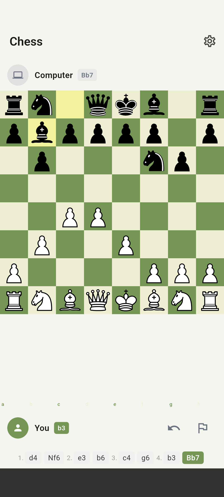
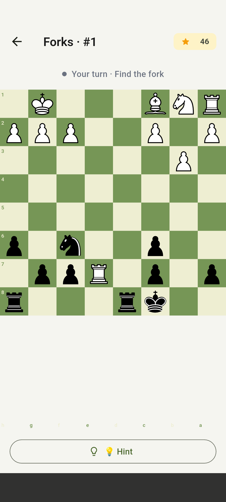
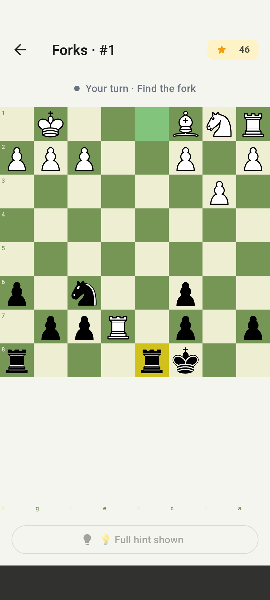
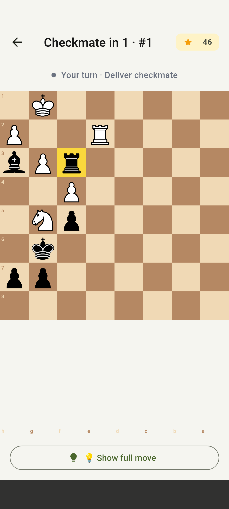

# Chess3000

A clean, offline chess app for Android and iOS built with Flutter.

No ads. No accounts. No internet required.

## Features

- **Play vs AI** — six difficulty levels powered by Stockfish running fully on-device
- **Puzzle Challenges** — curated Lichess puzzles with hints and progress tracking
- **Stats tracking** — win/loss history and puzzle solve counts, stored locally

## Screenshots

|                                                                                              |                                                                                       |
| ---------------------------------------------------------------------------------------------- | --------------------------------------------------------------------------------------- |
|  Play with Computer    |                 |
|  Puzzle with Full Hint | Classical Board |

## Tech Stack

| Concern          | Choice                                                            |
| ------------------ | ------------------------------------------------------------------- |
| Framework        | Flutter                                                           |
| Chess rules      | `chess` pub.dev package                                           |
| AI engine        | Stockfish via`stockfish_flutter` (FFI, on-device)                 |
| State management | Riverpod                                                          |
| Navigation       | go_router                                                         |
| Local storage    | `sqflite` (puzzles), `shared_preferences` (settings & game state) |
| Puzzle source    | Lichess open puzzle database (~50k puzzles, bundled as SQLite)    |
| Piece graphics   | Lichess open-source SVG piece sets (CBurnett, Merida)             |

## Difficulty Levels

| Level    | Stockfish Skill | Search Depth |
| ---------- | ----------------- | -------------- |
| Beginner | 1               | 3            |
| Easy     | 4               | 5            |
| Medium   | 8               | 8            |
| Hard     | 12              | 10           |
| Expert   | 16              | 13           |
| Master   | 20              | 15           |

## License

This project is licensed under the [Apache License 2.0](LICENSE).

### Third-party credits

Piece graphics: [Lichess](https://github.com/lichess-org/lila) open-source SVGs (AGPL).
Puzzle data: [Lichess puzzle database](https://database.lichess.org/#puzzles) (CC BY 4.0).
Sound effects: [Lichess](https://github.com/lichess-org/lila) (MIT).
Music: Kevin MacLeod (CC BY 4.0) — incompetech.com.
